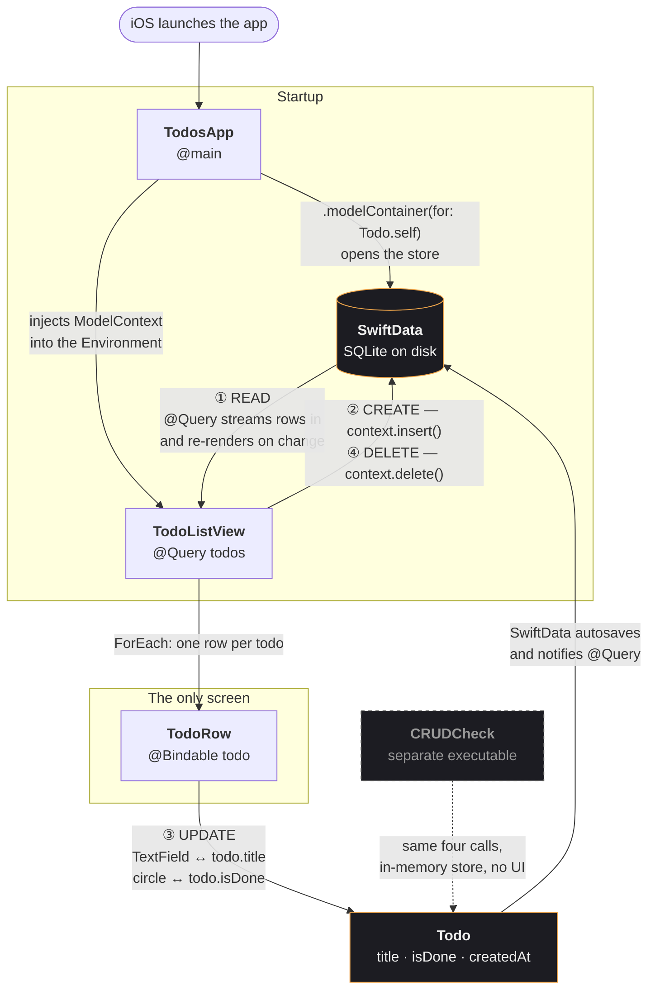

# Todos

A deliberately small iOS todo app. SwiftUI + SwiftData, Swift 6, iOS 26. No
dependencies, no view models, no architecture diagram — except the one below,
which is the whole thing.

## Files

| File | What it is |
|---|---|
| `Todos/Todo.swift` | The `@Model` class. The entire persistence layer. |
| `Todos/TodosApp.swift` | App entry point: one window, one model container, dark mode. |
| `Todos/TodoListView.swift` | The whole UI and all four CRUD operations. |
| `CRUDCheck.swift` | Standalone assert-based check. Not in the app target. |

Every file opens with what it is, how data flows through it, and who calls it —
and closes with what happens next.

## Data flow



Read it as one loop: **the database draws the list, the list mutates the model,
the model writes back to the database, and that write redraws the list.** There
is no layer in between — `@Query` and `@Bindable` *are* the wiring.

## CRUD

| | Where | What actually happens |
|---|---|---|
| **Create** | `TodoListView.create()` | `+` inserts a blank `Todo`, then hands it the keyboard. |
| **Read** | `@Query(sort: \Todo.createdAt)` | Streams the store into the list; re-renders itself on any change. |
| **Update** | `TodoRow` | `TextField` is bound straight to `todo.title`; the circle toggles `isDone`. |
| **Delete** | `TodoListView.delete(at:)` | Swipe a row — or leave one blank and tap away. |

## Design

Near-black canvas, warm paper-white text, one ember accent, New York serif for
body text. Four colors total, defined in the `Ink` enum at the top of
`TodoListView.swift`.

## Run

```sh
open Todos.xcodeproj      # then ⌘R
```

Or from the terminal:

```sh
xcodebuild -project Todos.xcodeproj -scheme Todos \
  -destination 'platform=iOS Simulator,name=iPhone 17 Pro' build
```

## Check

```sh
swiftc -o /tmp/crudcheck -parse-as-library Todos/Todo.swift CRUDCheck.swift && /tmp/crudcheck
# CRUD ok
```
