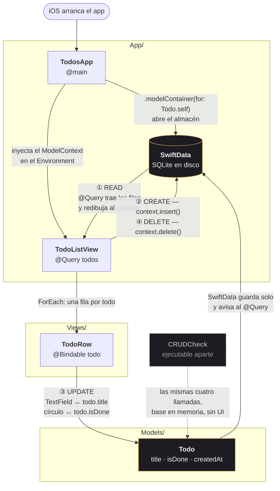

# Todos

App de tareas para iOS, deliberadamente pequeño. SwiftUI + SwiftData, Swift 6,
iOS 26. Sin dependencias, sin view models.

## Arquitectura

Agrupado por tipo — el layout estándar para un app chico (menos de ~10
pantallas). Pasado ese punto, reagrupar por feature, para que un cambio toque
una sola carpeta.

```
Todos/
├── App/        TodosApp.swift        punto de entrada, abre la base de datos
├── Models/     Todo.swift            clase @Model, la capa de persistencia
└── Views/      TodoListView.swift    la pantalla + TodoRow
CRUDCheck.swift                       prueba suelta, fuera del target del app
```

`Services/` (clientes de API, Keychain, etc.) va al lado de `Models/` — aparece
cuando haya un primer servicio que meterle, no antes.

Xcode toma estas carpetas solo: el target usa un grupo sincronizado con el
sistema de archivos, así que agregar un archivo al disco lo agrega al build.
No hay que editar `project.pbxproj`.

Cada archivo abre diciendo qué es y cómo fluyen los datos por él, lleva un
comentario corto por línea, y cierra con qué pasa después. Comentarios y
documentación en español; los strings de la UI están en inglés.

## Flujo de datos



Léelo como un solo ciclo: **la base dibuja la lista, la lista muta el modelo, el
modelo escribe de vuelta en la base, y esa escritura redibuja la lista.** No hay
capa en medio — `@Query` y `@Bindable` *son* el cableado.

## CRUD

| | Dónde | Qué pasa en realidad |
|---|---|---|
| **Create** | `TodoListView.create()` | El `+` inserta un `Todo` en blanco y le entrega el teclado. |
| **Read** | `@Query(sort: \Todo.createdAt)` | Trae el almacén a la lista; se redibuja solo ante cualquier cambio. |
| **Update** | `TodoRow` | El `TextField` está enlazado directo a `todo.title`; el círculo alterna `isDone`. |
| **Delete** | `TodoListView.delete(at:)` | Swipe sobre la fila — o dejarla en blanco y tocar afuera. |

## Diseño

Fondo casi negro, texto blanco cálido, un solo acento ámbar, serif New York para
el cuerpo. Cuatro colores en total, en el enum `Ink` arriba de `TodoListView.swift`.

## Correr

```sh
open Todos.xcodeproj      # después ⌘R
```

O desde la terminal:

```sh
xcodebuild -project Todos.xcodeproj -scheme Todos \
  -destination 'platform=iOS Simulator,name=iPhone 17 Pro' build
```

## Probar

```sh
swiftc -o /tmp/crudcheck -parse-as-library Todos/Models/Todo.swift CRUDCheck.swift && /tmp/crudcheck
# CRUD ok
```
